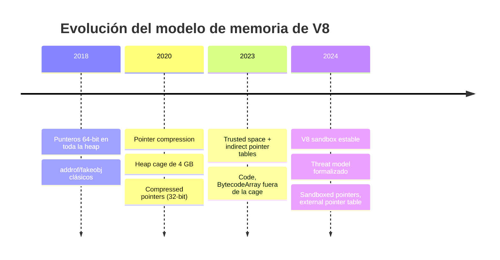
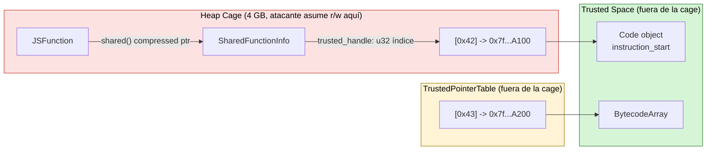
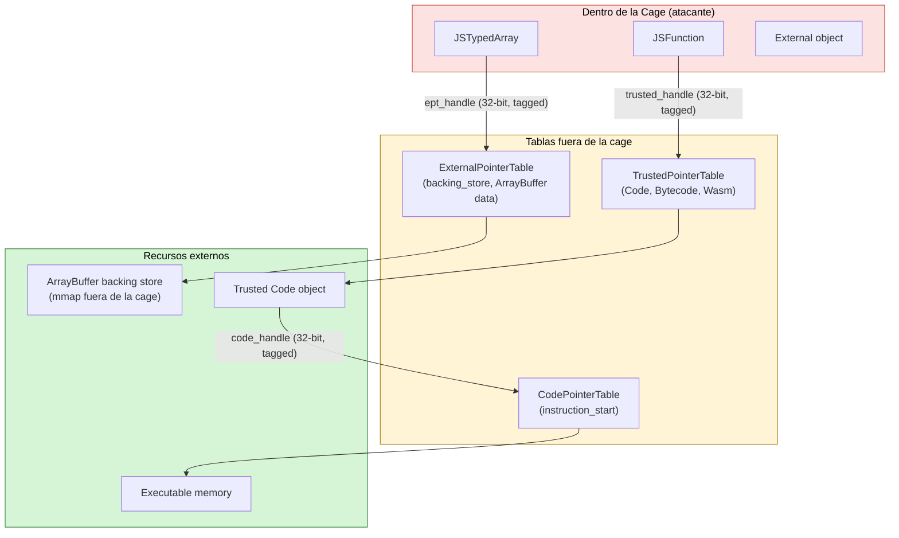

V8 ha cambiado más en los últimos cinco años que en toda la década anterior. La introducción de **pointer compression**, la separación de objetos en distintos **spaces** según su nivel de confianza, y finalmente la aparición del **V8 sandbox** han reescrito por completo el camino que recorre un atacante desde un *type confusion* en TurboFan hasta `RCE` en el proceso del renderer.

Este post inaugura la serie. Es una **guía de orientación**: vamos a montar el laboratorio mínimo, fijar el vocabulario (cage, trusted space, sandbox), y dibujar el mapa de memoria sobre el que vamos a trabajar en los siguientes posts. No vamos a desarrollar un exploit aquí — vamos a explicar *en qué tablero* se juega hoy.

> ##### TIP
>
> Todo lo que sigue está orientado a investigación defensiva, CTFs y análisis de CVEs públicos.
> Las flags de `d8` que vamos a usar (`--allow-natives-syntax`, `--sandbox-testing`, etc.) están deshabilitadas en Chrome de producción precisamente porque rompen las invariantes de seguridad del motor.
{: .block-tip }

---

## 1. Por qué V8 hoy es un objetivo distinto

Tres cambios estructurales explican por qué los exploits de V8 que funcionaban en 2018 no son trasladables sin cirugía mayor:

1. **Pointer compression (≈ 2020)** — los punteros a heap dejaron de ser de 64 bits. Ahora son **offsets de 32 bits** dentro de una región reservada, la *heap cage* (también llamada *pointer compression cage*).
2. **Trusted space y trusted pointer table (≈ 2023)** — objetos cuyos campos son **interpretados como código o como tablas de salto** (`Code`, `BytecodeArray`, `WasmTrustedInstanceData`, ...) viven fuera de la cage en una región separada que el atacante *no* puede alcanzar mediante corrupción dentro de la heap principal.
3. **V8 sandbox (estable en 2024+)** — el modelo formaliza que **una corrupción arbitraria dentro de la cage no debe permitir escapar a `RCE`**. Los punteros sensibles se indirectan a través de tablas externas. Romper esto se considera bug de seguridad por sí mismo.

Visto en una línea de tiempo:



El **threat model del sandbox** está documentado en el repo upstream — vale la pena leerlo entero antes de empezar:

- [`src/sandbox/README.md`](https://chromium.googlesource.com/v8/v8/+/refs/heads/main/src/sandbox/README.md)
- [V8 sandbox design doc](https://docs.google.com/document/d/1FM4fQmIhEqPG8uGp5o9A-mnPB5BOeScZYpkHjo0KKA8/)

---

## 2. Montando el laboratorio: `d8` desde fuente

`d8` es el *developer shell* de V8 — un binario standalone que embebe la máquina virtual sin todo el peso de Chrome. Es el lugar donde se desarrollan PoCs y se reproducen CVEs históricos antes de portarlos al renderer.

### 2.1 Obtener `depot_tools` y el código

```bash
# Pre-requisitos en Debian/Ubuntu
sudo apt install -y git curl python3 pkg-config build-essential

# depot_tools (gclient, gn, ninja, fetch)
git clone https://chromium.googlesource.com/chromium/tools/depot_tools.git
export PATH="$PWD/depot_tools:$PATH"

# Sincronizar V8
mkdir v8 && cd v8
fetch v8
cd v8
gclient sync
```

### 2.2 Builds que vamos a usar

Para investigación necesitamos al menos **dos builds**: uno de release con símbolos para reproducir exploits "como en Chrome", y uno de debug con `DCHECK`s activos para entender qué invariantes rompe un PoC.

```bash
# Release con símbolos (rápido, casi como Chrome)
tools/dev/gm.py x64.release
# ./out/x64.release/d8

# Debug (DCHECKs, asserts, lento — útil para crashes)
tools/dev/gm.py x64.debug
# ./out/x64.debug/d8
```

> ##### TIP
>
> Para empezar es **mucho** más cómodo usar `gm.py` que llamar a `gn`/`ninja` a mano: gestiona los `args.gn` por ti y entiende abreviaturas como `x64.release.check` (release + DCHECKs).
{: .block-tip }

Si quieres replicar exactamente el binario de un commit antiguo (por ejemplo, para reproducir un CVE):

```bash
git checkout <commit-sha-vulnerable>
gclient sync -D                  # ajusta dependencias a ese commit
tools/dev/gm.py x64.release
```

### 2.3 Build con sandbox y con ayudas para atacantes

V8 expone un modo especial — el ***sandbox testing mode*** — pensado para que un investigador *asuma* una corrupción arbitraria dentro de la cage y vea qué se puede hacer desde ahí. Se activa con `v8_enable_sandbox = true` (ya es el default) y al ejecutar con `--sandbox-testing`.

`args.gn` recomendado para el laboratorio:

```python
# out/x64.research/args.gn
is_debug              = false
symbol_level          = 2          # frames legibles en gdb
v8_symbol_level       = 2
v8_enable_sandbox     = true       # V8 sandbox (default, pero explícito)
v8_enable_pointer_compression = true
v8_enable_disassembler        = true
v8_enable_object_print        = true   # %DebugPrint() bonito
v8_enable_verify_heap         = true
v8_optimized_debug            = false
dcheck_always_on              = true
```

Compila con:

```bash
gn gen out/x64.research
autoninja -C out/x64.research d8
```

---

## 3. Flags de `d8` que vas a usar todo el rato

Estas son las flags que aparecen en el 90% de los PoCs que vas a leer:

| Flag                                | Para qué sirve                                                                 |
| ----------------------------------- | ------------------------------------------------------------------------------ |
| `--allow-natives-syntax`            | Habilita `%FunctionName(...)` desde JS: `%DebugPrint`, `%SystemBreak`, etc.   |
| `--sandbox-testing`                 | Tras inicializar, deja una shell con primitivas que **asumen** corrupción.    |
| `--print-bytecode`                  | Volcado del bytecode de Ignition para cada función.                           |
| `--trace-turbo` / `--trace-turbo-graph` | Logs de TurboFan + JSON para `turbolizer`.                                |
| `--trace-opt` / `--trace-deopt`     | Cuándo una función se optimiza o se *deoptimiza* y por qué.                   |
| `--print-opt-code`                  | Imprime el código nativo generado por TurboFan/Maglev.                        |
| `--maglev` / `--no-maglev`          | Activa/desactiva el JIT intermedio Maglev (entre Ignition y TurboFan).        |
| `--no-lazy-feedback-allocation`     | Fuerza vectores de feedback eagerly — útil para reproducir bugs de specul.    |
| `--predictable`                     | Single-thread + GC determinista. Imprescindible para reproducir.              |
| `--shell`                           | REPL interactivo.                                                              |

Ejemplo de sesión típica para inspeccionar un objeto:

```javascript
// d8 --allow-natives-syntax
let a = [1.1, 2.2, 3.3];
%DebugPrint(a);
%SystemBreak();   // SIGTRAP — gdb se engancha aquí
```

`%DebugPrint` te da algo como (resumido):

```text
DebugPrint: 0x1f8c0009a4e9: [JSArray]
 - map: 0x1f8c0014a3e9 <Map(PACKED_DOUBLE_ELEMENTS)>
 - prototype: 0x1f8c0014a169 <JSArray[0]>
 - elements: 0x1f8c0009a4d1 <FixedDoubleArray[3]>
 - length: 3
 - properties: 0x1f8c000006e1 <FixedArray[0]>
```

Esas direcciones que ves (`0x1f8c0009a4e9`) son **direcciones completas de 64 bits** que `%DebugPrint` reconstruye sumando la base de la cage al puntero comprimido de 32 bits que V8 realmente guarda en el objeto. Volvemos a esto en la sección 5.

### 3.1 Logs útiles más allá de `d8`

- `--logfile=- --log-all` → todo el `v8.log` por stdout (útil para `tick-processor`).
- `--prof` + `tools/linux-tick-processor` → perfil de CPU.
- `--trace-gc` / `--trace-gc-verbose` → cada GC mayor/menor con tamaños por space.
- `--trace-maps` → cada vez que se crea o se promociona un `Map` (transiciones de shape).

Para auditoría de optimizaciones específicamente:

```bash
d8 --allow-natives-syntax \
   --trace-turbo --trace-turbo-graph \
   --trace-opt --trace-deopt \
   poc.js 2>&1 | tee run.log
```

El JSON `turbo-*.json` que cae en el cwd se abre con [Turbolizer](https://v8.github.io/tools/head/turbolizer/index.html) y te muestra los grafos de TurboFan paso a paso — imprescindible para entender bugs de *typer* o *escape analysis*.

---

## 4. Pointer compression: la geografía de la heap

Antes de hablar de cage o trusted space tenemos que entender **qué es un puntero en V8 hoy**. Spoiler: no es lo que aprendimos.

### 4.1 La idea

En 64 bits, un puntero ocupa 8 bytes. En una VM con millones de objetos pequeños eso es muchísima memoria gastada solo en *referencias*. **Pointer compression** explota una observación:

> Si reservamos una región contigua de **4 GB alineada a 4 GB** para todo el heap, podemos representar cualquier puntero dentro de esa región con solo **32 bits** (un offset). Para "descomprimirlo" basta con sumarle la **base de la cage**.

A esa región se le llama indistintamente *pointer compression cage*, *main cage* o simplemente *V8 heap*. Vive en `IsolateGroup::GetPtrComprCage()`:

- [`src/common/ptr-compr-inl.h`](https://chromium.googlesource.com/v8/v8/+/refs/heads/main/src/common/ptr-compr-inl.h)
- [`src/heap/heap.h`](https://chromium.googlesource.com/v8/v8/+/refs/heads/main/src/heap/heap.h)

```typograms
0x1f8c00000000
+--------------------------------------------------+ <- cage base (alineada a 4 GB)
| young generation (new_space)                     |
| - allocation hot path, scavenger                 |
+--------------------------------------------------+
| old_space    (objetos promovidos, JSObject...)   |
+--------------------------------------------------+
| code_space   (legacy, cada vez menos usado)      |
+--------------------------------------------------+
| large_object_space                               |
+--------------------------------------------------+
| read_only_space (mapas inmutables, undefined...) |
+--------------------------------------------------+ <- cage base + 4 GB
```

Dentro de la cage los punteros se guardan como `Tagged_t` (32 bits). La operación de descompresión es esencialmente:

```cpp
// src/common/ptr-compr-inl.h (simplificado)
Address DecompressTagged(Tagged_t compressed) {
  return cage_base_ | static_cast<uintptr_t>(compressed);
}
```

### 4.2 Smis y HeapObjects

V8 usa **pointer tagging**. El bit menos significativo distingue:

- `xxxx...xxx0` → **Smi** (Small Integer). El valor cabe en los bits superiores. No es un puntero, no se sigue.
- `xxxx...xxx1` → **HeapObject**. El resto es un puntero (en 64-bit clásico) o un offset (con pointer compression).

```typograms
HeapObject tagged (32-bit compressed):
+---------------------------------+--+
| offset dentro de la cage   (31) | 1|
+---------------------------------+--+

Smi (32-bit compressed):
+---------------------------------+--+
| valor entero (31 bits, signed)  | 0|
+---------------------------------+--+
```

Esto tiene una consecuencia explotable famosa: **cualquier `double` cuyos 32 bits bajos tengan el bit 0 a 1 puede ser malinterpretado como un puntero comprimido** si conseguimos un *type confusion* entre `PACKED_DOUBLE_ELEMENTS` y `PACKED_ELEMENTS`. Es exactamente el sustrato de los *addrof/fakeobj* modernos en V8.

### 4.3 Consecuencias para el atacante

| Antes (sin compresión)                          | Hoy (con compresión)                                                   |
| ----------------------------------------------- | ---------------------------------------------------------------------- |
| OOB write da puntero 64-bit arbitrario          | OOB write solo te da **32 bits** — estás encerrado en 4 GB             |
| `addrof` produce dirección absoluta             | `addrof` produce **offset desde la cage base**                          |
| Leer/escribir cualquier dirección del proceso   | Por defecto: solo dentro de la cage                                     |
| Pivotar a libc / `system()` es directo          | Necesitas un *out-of-cage primitive* (sandbox escape)                  |

Esa última fila es precisamente la motivación del V8 sandbox, que veremos en la sección 7.

---

## 5. ¿Qué vive en la heap cage?

La cage es el **terreno donde el atacante asume que ya tiene corrupción arbitraria**. Es importante saber qué pesca uno desde ahí.

Conviven en la cage:

- **`JSObject`, `JSArray`, `JSFunction`, `JSTypedArray`, `JSArrayBuffer`** — todos los objetos JS visibles.
- **`Map`** — describe la "shape" de un objeto: tamaño, tipo de elementos, prototipo, transiciones. Es lo que TurboFan especula.
- **`FixedArray`, `FixedDoubleArray`** — backing stores de propiedades indexadas.
- **`PropertyArray`, `NameDictionary`** — backing de propiedades con nombre.
- **`String`, `ConsString`, `SlicedString`, `ExternalString`** — cadenas.
- **`SharedFunctionInfo`, `FeedbackVector`** — metadata por función y por *call site*.
- **`Context`, `ScopeInfo`** — entornos léxicos.

Layout de un `JSArray` típico (con `PACKED_DOUBLE_ELEMENTS`, tagged 32-bit):

```typograms
JSArray @ cage_base + 0x9a4e8
+--------+-----------------+----------------------+
| offset | field           | value                |
+--------+-----------------+----------------------+
| +0x00  | map             | -> Map(PACKED_DOUBLE)|
| +0x04  | properties      | -> FixedArray[0]     |
| +0x08  | elements        | -> FixedDoubleArray  |
| +0x0c  | length          | Smi(3)               |
+--------+-----------------+----------------------+

FixedDoubleArray @ ...
+--------+-----------------+----------------------+
| +0x00  | map             | -> Map(FIXED_DOUBLE) |
| +0x04  | length          | Smi(3)               |
| +0x08  | element[0]      | 1.1 (8 bytes raw)    |
| +0x10  | element[1]      | 2.2                  |
| +0x18  | element[2]      | 3.3                  |
+--------+-----------------+----------------------+
```

Fíjate en una cosa importante: el **`map`** (el shape) también está en la cage. Si tienes write-what-where dentro de la cage, **puedes reescribir el `map` de un objeto** y convertir un `JSArray` en otra cosa. Históricamente, este truco daba R/W universal en el proceso entero. Hoy te da R/W **dentro de la cage**, y para escapar de ahí hace falta más trabajo (ver sección 7).

### 5.1 Cómo verificarlo en vivo

```javascript
// d8 --allow-natives-syntax
let a = [1.1, 2.2, 3.3];
let o = { x: 1, y: 2 };

%DebugPrintPtr(a);   // muestra el puntero crudo (32-bit comprimido)
%DebugPrintPtr(o);
%HeapObjectVerify(a);
```

Y si quieres ver *todo* lo que vive en cada space:

```bash
d8 --allow-natives-syntax poc.js \
   --trace-gc --heap-stats
```

---

## 6. Trusted space: lo que el atacante **no** debe poder tocar

Hasta 2023, objetos como `Code` (código nativo JITeado) y `BytecodeArray` (bytecode de Ignition) vivían dentro de la cage. Eso significaba que una R/W dentro de la cage permitía:

- Reescribir el campo `instruction_start` de un `Code` y saltar a shellcode.
- Reescribir el bytecode de una función para hacer que Ignition interpretase instrucciones controladas.

Ambas técnicas estuvieron en exploits públicos durante años (`p0` issue tracker, Pwn2Own writeups). La respuesta de V8 fue mover esos objetos a una región separada: el **trusted space**.

### 6.1 La idea

El trusted space es **otra región** de memoria, distinta de la cage, que aloja objetos cuyo contenido se interpreta como código o como índices de control de flujo. Los objetos en la cage **no pueden apuntar directamente** a objetos en el trusted space — la referencia va a través de una **`TrustedPointerTable`**.



`SharedFunctionInfo::trusted_function_data` ya no es un puntero a `Code`. Es un **índice de 32 bits** en la `TrustedPointerTable`. Cada entrada de la tabla guarda:

- Un puntero de 64 bits al objeto en trusted space.
- Un **tag** que identifica el tipo esperado (`Code`, `BytecodeArray`, `WasmTrustedInstanceData`, ...).

Cuando el VM resuelve el handle, **verifica el tag**. Si un atacante con r/w en la cage cambia el índice para que apunte a otro slot, ese slot tiene su propio tag y la operación falla.

### 6.2 Qué objetos viven en trusted space

- **`Code`** — código nativo generado por TurboFan / Maglev / Sparkplug.
- **`BytecodeArray`** — bytecode de Ignition.
- **`InstructionStream`** — buffer ejecutable subyacente a `Code`.
- **`WasmTrustedInstanceData`, `WasmDispatchTable`** — estado de instancia y tablas indirectas de WebAssembly. Críticas para call_indirect en wasm.
- **`RegExpData`** — autómatas compilados de RegExp irregexp.

Una buena referencia es el directorio [`src/sandbox/`](https://chromium.googlesource.com/v8/v8/+/refs/heads/main/src/sandbox/) y específicamente:

- `trusted-pointer-table.h`
- `code-pointer-table.h` (variante específica para `Code`)
- `indirect-pointer-tag.h` — la lista de tags válidos

### 6.3 Por qué esto rompe las técnicas clásicas

> ##### WARNING
>
> Si lees un writeup de un exploit V8 anterior a 2023 que escribe sobre `instruction_start` o sustituye un `BytecodeArray` con uno controlado en la heap, **eso ya no funciona en versiones modernas**. El objeto destino vive fuera de la cage y la referencia es indirecta y tagueada.
{: .block-warning }

El camino moderno para llegar a *code execution* desde corrupción en la cage normalmente pasa por **WebAssembly** (cuyo código JITeado tiene reglas distintas) o por **bugs en la propia indirect pointer table / sandbox**, que son ahora un *target* de primera clase. Volveremos a esto.

---

## 7. El V8 sandbox

El sandbox **no es una jaula de syscalls** (eso lo hace Chrome a nivel de proceso). El V8 sandbox es un **modelo de memoria** que asume:

> "Un atacante puede leer y escribir arbitrariamente dentro de la heap cage. A pesar de ello, **no debe poder ejecutar código arbitrario** ni leer/escribir fuera de la cage."

Para sostener esa promesa, todos los punteros que **salen** de la cage se indirectan a través de tablas externas:



Tres tablas, tres "niveles de exterior":

| Tabla                     | Qué indirecta                                          | Defensa principal                          |
| ------------------------- | ------------------------------------------------------ | ------------------------------------------ |
| `ExternalPointerTable`    | Buffers C++, callbacks, `embedder_data`                | Tagging por tipo + entradas reutilizadas    |
| `TrustedPointerTable`     | `Code`, `Bytecode`, instancias wasm                    | Tags estrictos por tipo de objeto           |
| `CodePointerTable`        | `Code -> instruction_start` (memoria ejecutable)       | Slot separado para el entry point          |

> ##### DANGER
>
> Una entrada **mal taggeada** o una tabla **con corrupción** rompen todo el modelo. Por eso las propias tablas viven **fuera de la cage** y se mapean con permisos distintos, y por eso `--sandbox-testing` existe: para que la gente de V8 (y los investigadores) le den de palos al modelo asumiendo el peor caso.
{: .block-danger }

### 7.1 El modo "asumimos corrupción": `--sandbox-testing`

`--sandbox-testing` arranca `d8` y, después de inicializar todo, deja un REPL con una serie de **primitivas que simulan que ya tienes R/W en la cage**:

```javascript
// d8 --sandbox-testing
// La función global Sandbox.* expone primitivas de "asumiendo corrupción"
Sandbox.base;                     // dirección base de la cage
Sandbox.byteLength;               // 4 GB
Sandbox.MemoryView;               // Uint8Array de toda la cage
Sandbox.getAddressOf(obj);        // offset de obj dentro de la cage
Sandbox.getObjectAt(off);         // recupera el objeto en ese offset
```

Esto es **exactamente** lo que un atacante tendría tras un bug de TurboFan típico. La pregunta que el equipo de V8 (y nosotros) quiere responder es: *desde aquí, ¿puedes escapar de la cage?* Cada vez que la respuesta es "sí", es un bug de seguridad del sandbox por sí mismo, independientemente del bug que te dio la R/W inicial.

Esa es una **inversión enorme** del modelo: el listón para un exploit ya no es "consigo r/w arbitrario", es "consigo r/w arbitrario *y además* tengo una primitiva fuera de la cage".

### 7.2 Lecturas de referencia

- [V8 sandbox README](https://chromium.googlesource.com/v8/v8/+/refs/heads/main/src/sandbox/README.md) — modelo y motivación.
- [Sandbox VRP rules (Chromium)](https://g.co/chrome/vrp) — Google paga por *sandbox escape* aunque no haya bug en la VM.
- Charlas: **Off By One Security**, *V8 Sandbox: a journey from idea to production*, y los writeups del *Pwn2Own 2024/2025* renderer category.
- Issues etiquetados `component:Blink>Bindings,Sandbox` en [bugs.chromium.org](https://bugs.chromium.org/).

---

## 8. Mapa mental para la serie

Con todo lo anterior podemos dibujar el "tablero" sobre el que se mueve un exploit de V8 hoy:

```mermaid
flowchart LR
    BUG["Bug raíz<br/>(typer, escape analysis,<br/>OOB en builtin, wasm...)"]
    RW["R/W arbitrario dentro<br/>de la heap cage"]
    SBX_ESC["Escape del<br/>V8 sandbox<br/>(out-of-cage primitive)"]
    RCE["Code exec en el<br/>proceso renderer"]
    BROKER["Salto al broker /<br/>kernel (otra historia)"]

    BUG -- "addrof / fakeobj /<br/>map confusion" --> RW
    RW -- "abuso de external pointer<br/>table, bug del sandbox,<br/>wasm primitives" --> SBX_ESC
    SBX_ESC -- "JIT spray, ROP en<br/>código ejecutable,<br/>wasm jit" --> RCE
    RCE -- "Mojo IPC, GPU,<br/>file:// tricks" --> BROKER

    style BUG fill:#dfe7fd,stroke:#3a5fcd,color:#000
    style RW fill:#fde2e2,stroke:#c0392b,color:#000
    style SBX_ESC fill:#fff4d6,stroke:#a37a00,color:#000
    style RCE fill:#d6f5d6,stroke:#2e7d32,color:#000
    style BROKER fill:#e8d6f5,stroke:#6a1b9a,color:#000
```



Cada flecha es un **post entero**. En los siguientes vamos a:

1. Tomar un bug público de TurboFan (un *typer bug* clásico) y montar `addrof`/`fakeobj` desde cero **en V8 con pointer compression**.
2. Convertir esas primitivas en R/W de toda la cage usando `ArrayBuffer` con backing store interno.
3. Estudiar tres técnicas conocidas para salir de la cage: WASM JIT, abuso de `ExternalPointerTable`, y bugs del sandbox propiamente.
4. Discutir cómo se integra todo en una cadena renderer → broker.

---

## 9. Referencias rápidas

Código upstream que vale la pena tener abierto en una pestaña:

- [`v8/src/sandbox/`](https://chromium.googlesource.com/v8/v8/+/refs/heads/main/src/sandbox/) — sandbox, tablas, tags.
- [`v8/src/common/ptr-compr-inl.h`](https://chromium.googlesource.com/v8/v8/+/refs/heads/main/src/common/ptr-compr-inl.h) — compresión/descompresión.
- [`v8/src/heap/`](https://chromium.googlesource.com/v8/v8/+/refs/heads/main/src/heap/) — spaces, GC.
- [`v8/src/objects/`](https://chromium.googlesource.com/v8/v8/+/refs/heads/main/src/objects/) — definiciones de `JSObject`, `Map`, `Code`, etc.
- [`v8/src/wasm/`](https://chromium.googlesource.com/v8/v8/+/refs/heads/main/src/wasm/) — wasm runtime y trusted instance data.

Bibliografía pública orientada a explotación:

- [`saelo`'s exploits and posts](https://saelo.github.io/) — referencia obligatoria.
- [Project Zero blog](https://googleprojectzero.blogspot.com/) — sobre todo los writeups de *In-the-Wild* de Chrome.
- [`@_manfp`, `@kuqd`, `@__qaz__` Pwn2Own writeups](https://github.com/) — caza de bugs modernos.
- [V8 dev list](https://groups.google.com/g/v8-dev) — discusiones de diseño del sandbox.

En el próximo post montamos `addrof` y `fakeobj` modernos sobre un build de `d8` con pointer compression. Hasta entonces, te recomiendo levantar el lab con las flags de la sección 3 y jugar con `%DebugPrint` hasta tener intuición de qué hay en cada slot de un `JSObject`.
